# MyManager

## Introduction

MyManager is application for managing employees & users using GUI & MySQL.Note that this is just a
prototype,IS NOT
INTENDED FOR PRODUCTION PURPOSES.

## Technology Stack

1. Java 11
2. HikariCP
3. Liquibase
4. Jackson
5. Slf4j
6. Junit5
7. Lombok
8. AssertJ
9. Apache commons
10. Swing
11. MySQL
12. Maven
13. Docker

## TO SETUP

<br>1. Install docker & docker compose locally
<br>2. From parent directory type : docker compose up -d , this step should download images & setup
containers.Also db
schema & tables are created automatically.

## TO RUN

```
docker compose up -d
```

```
mvn -DskipTests=true clean install
```

```
java -jar ./desktop/target/desktop-0.0.1-SNAPSHOT-jar-with-dependencies.jar
```

Login using credentials as below :
<table>
<tr><td>Username</td> <td>Password</td></tr>
<tr><td>1</td> <td>1</td></tr>
<tr><td>admin</td> <td>admin</td></tr>
</table>

### Some ISSUES:

- Db schema is not normalized.
- Functionality is not fully implemented (history of changes ,document storage,additional details).
- Exceptions not handled.
- And last but not least : IT BECAME BORING AND I HAVE BETTER THINS TO DO,HAHAHAHAAHHA.

## IMAGES

### MAIN

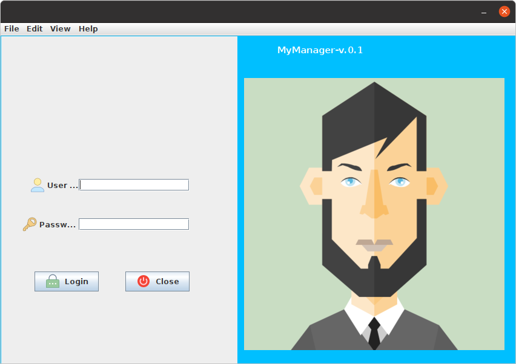
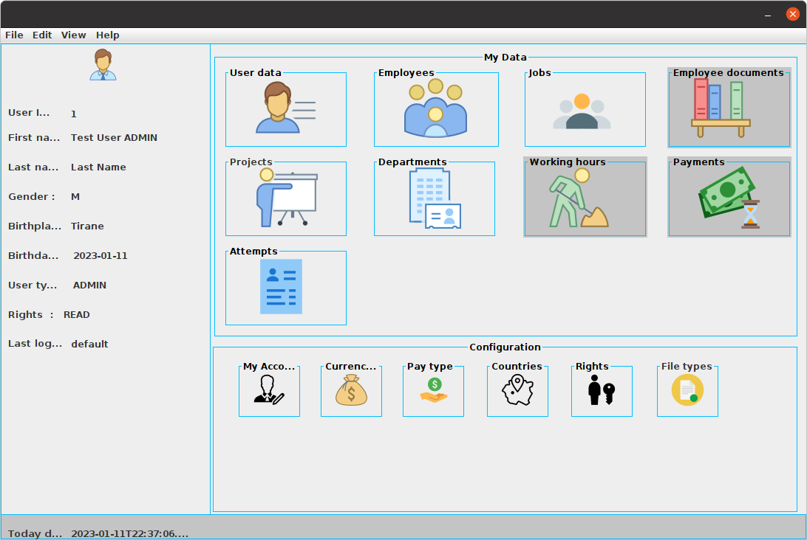
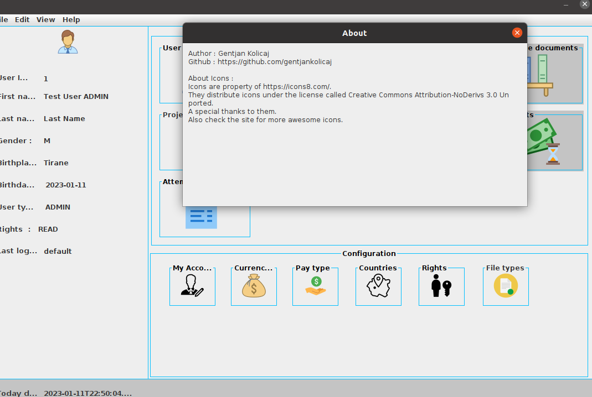

### USER

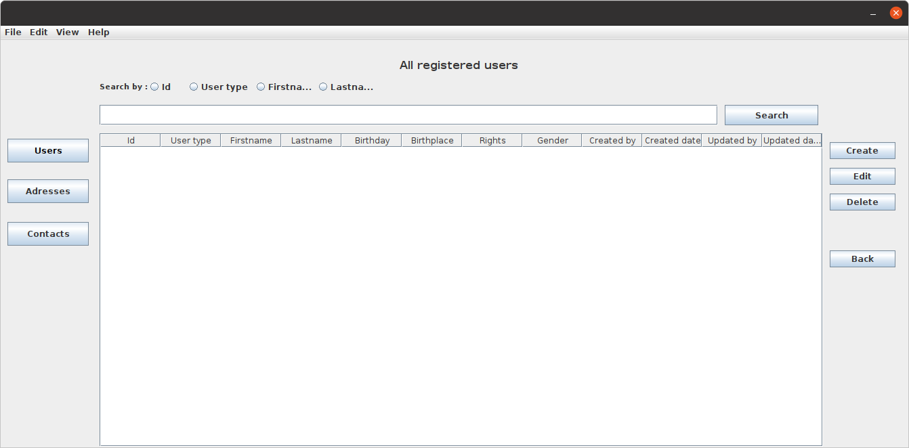
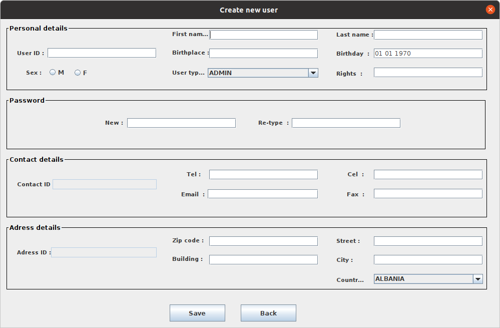
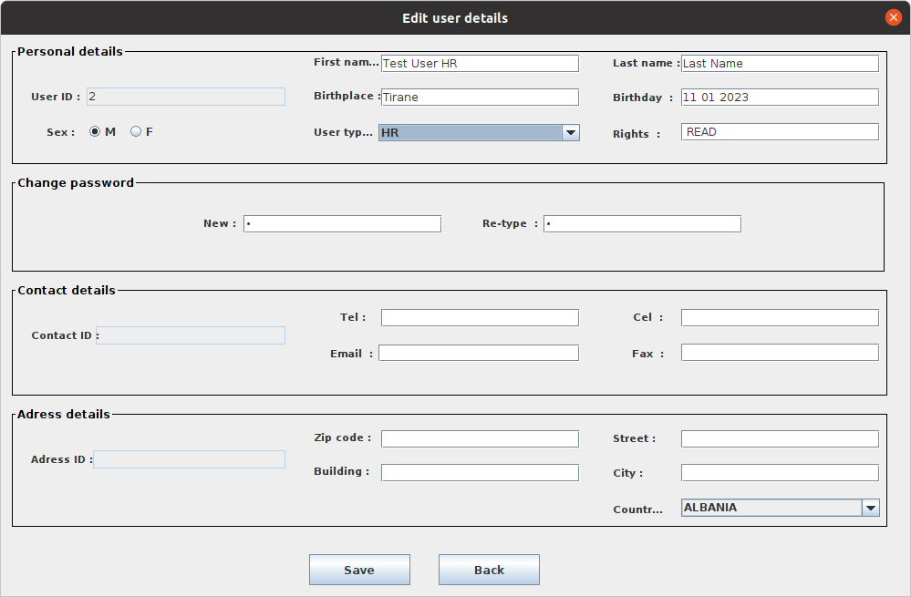

### LOGIN ATTEMPTS

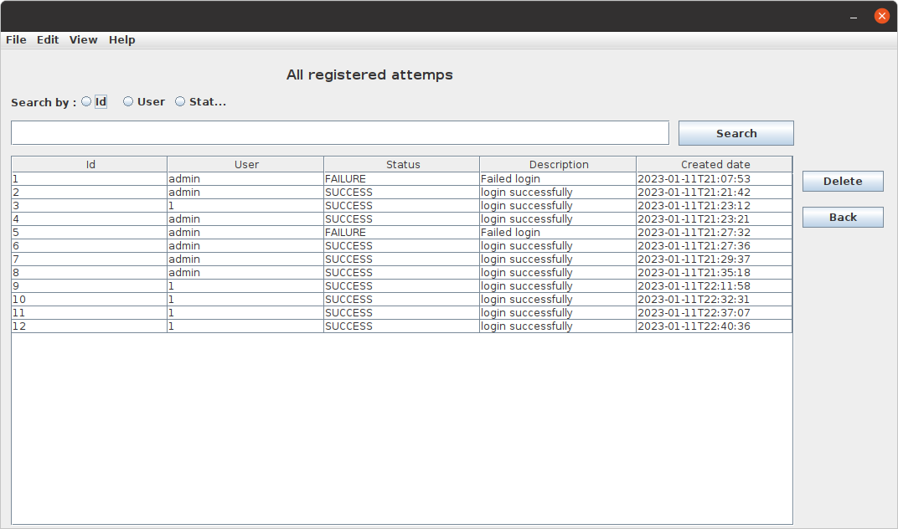

### OTHERS

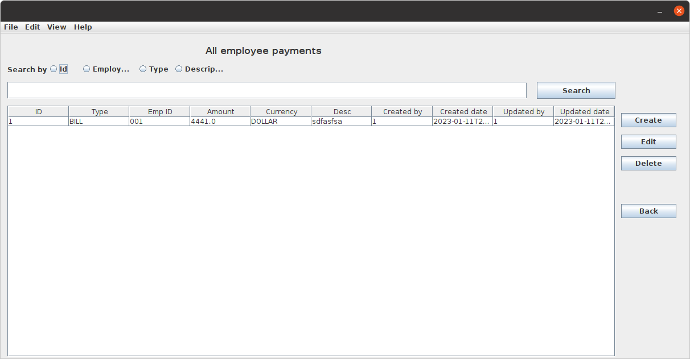
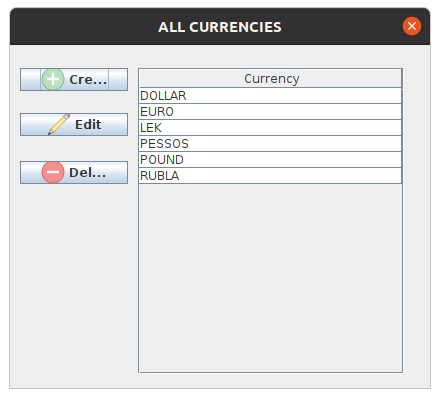
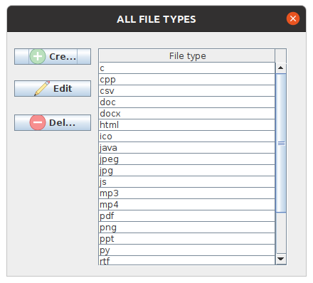
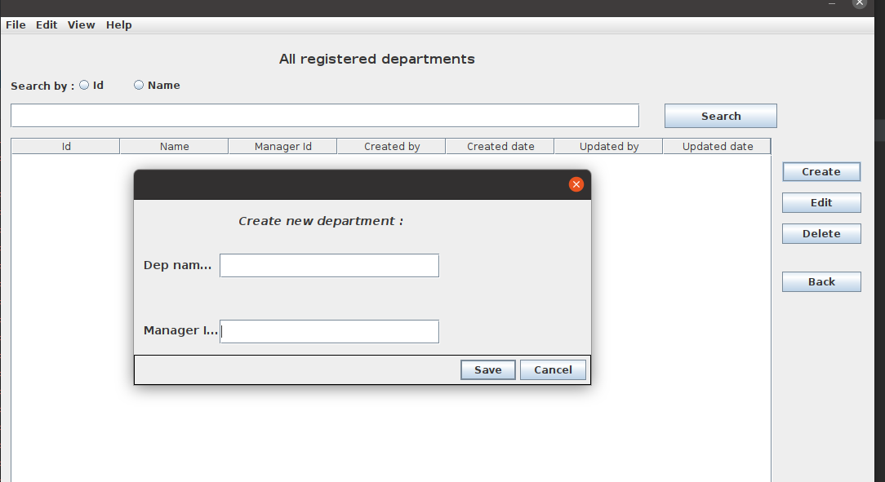
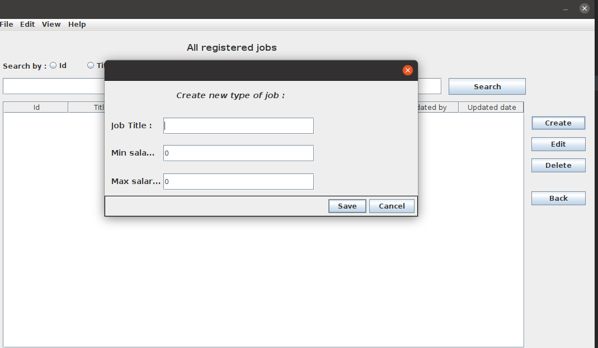
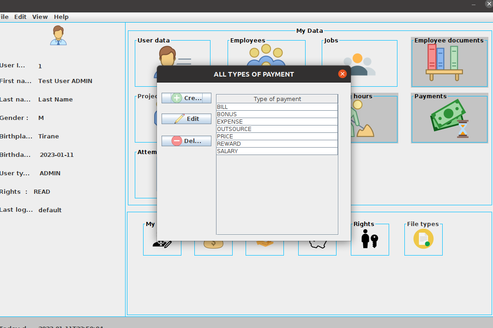


